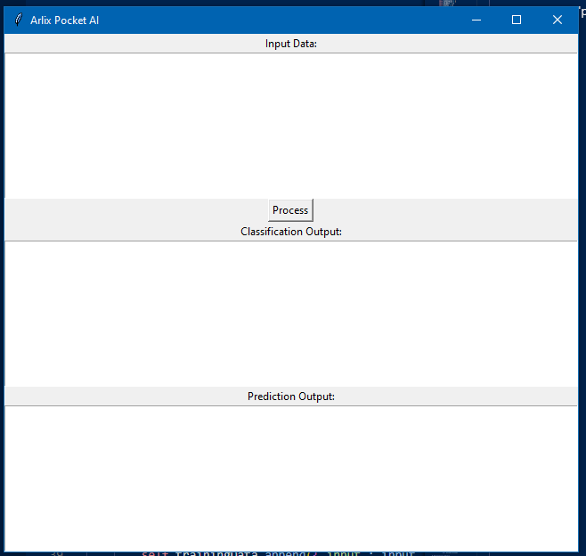
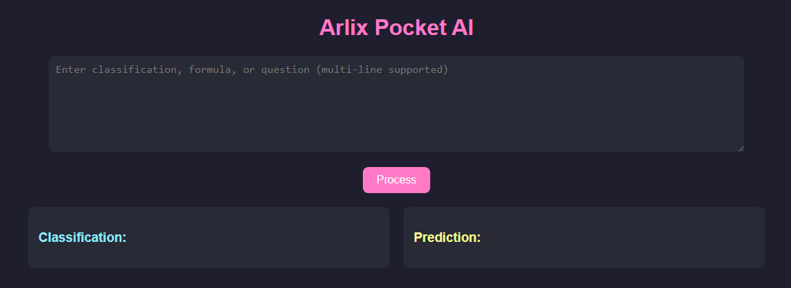

# Learn Arlix Pocket AI

## Input and Output types
it input 'prompt' and output in 'classification' and 'prediction' 

as you can see there are 1 input and 2 ouput

## Basics Working of Arlix Pocket AI
Arlix Pocket AI have 3 main components
1. Classification
2. Prediction
3. ANNs
The ai take input in commands, training data or testing data and output in prediction and classification

The Prediction is the main output and the Classification is stored or new added knowldage to ai's memory

## Learning AI's language
Now not wasting time, we will start learning ai

### 1. store data in AI's memory
In Arlix, The data is stored in AI's Memory in form of feilds , each feild have a keys and each key have a value

value can be a string also!

to store any data to AI's memory so write

```feild -> key:value```

like: 
"```apple -> color:red```"

later we can store as much key/value there as we want in 'apple'

like "```apple -> amount:5```"

it will be stored like this:

```json
{
  "formulas": {},
  "classifications": {},
  "apple": {
    "color": "red",
    "amount": "5"
  }
}
```

## testing or checking stored value
to check the key and value stored in apple:

we can write ```feild?``` like ```apple?```

it will output 


prediction -
```
color of apple = red
amount of apple = 5
```
if you want to check the value of a key in a feild, so you can write ```feild key?``` like ```apple color?```:

prediction:
```
color of apple = red
```

## deleting feild 
you can delete feild using ```del feild``` like ```del apple```:

prediction:
```
Deleted apple and all its properties.
```

## supervised and unsupervised classification
we can give some names or objects like ```apple, banana, phone, ball, aarav, tashi, tashi```
and tell them to do classification in ```human, fruit, playing-object, electric```, today we will learn how to do it with arlix pocket ai

we can do it
```dog, cow, dog, cat, dog, human``` into ```animal human cats```

we will use 
```[object] class```
like ```[dog, cow, dog, cat, dog, human] animal human cats```

the ai will do classification and show in prediction - 
```json
Auto-Classification:
{
  "animal": [
    "dog",
    "dog",
    "dog"
  ],
  "human": [
    "human"
  ],
  "cats": [
    "cow",
    "cat"
  ]
}
```

and if we don't tell about where to do classification or also known as unsupervised learning, we can do it by writting ```[objects]?``` like 
```[dog, cow, dog, cat, dog, human]?```

it will do classification and show prediction as-
```json
Unsupervised Learning:
{
  "dog": [
    "dog",
    "dog",
    "dog"
  ],
  "cow": [
    "cow"
  ],
  "cat": [
    "cat"
  ],
  "human": [
    "human"
  ]
}
```

and another example - ```[tashi, tashu, tashi, tash, aarav, aru, aarav, yuvraj, rosy, rosy]?```

it will do predicton or unsupervised classification as -
```json
Unsupervised Learning:
{
  "tashi": [
    "tashi",
    "tashu",
    "tashi",
    "tash"
  ],
  "aarav": [
    "aarav",
    "aarav"
  ],
  "aru": [
    "aru"
  ],
  "yuvraj": [
    "yuvraj"
  ],
  "rosy": [
    "rosy",
    "rosy"
  ]
```
## solving the fomulas
the ai can solve the fomulas like:
```
var = fomula
```
like :
```
a = 2+2
```
it will output in prediction
```python
a = 4
```
## storing and solving the fomulas
we can store fomula as same as storing data in the memory -

```formula -> var:fomula```
like ```formula -> basket:apple+banana```

make sure that you use 'fomula' as feild!

and to use or test them like this:
```formula basket apple=2 banana=3?```

prediction:
```
Result of formula basket = 5.0
```

## talk with ANN
this ai contain ann, so you can talk with them. these ann are not for main tasks!

there are 2 ann in it-
1. ann1 - 12 input, 15 layers of 12 hiddens each and 12 output
2. ann2 - 2 input, 3 hiddens (1 layer) and 2 output

we can give training data like this
```/a input:expected output```
like ```/a 1,2,3,4,5,6,7,8,9,10,11,12:12,11,10,9,8,7,6,5,4,3,2,1```

to train ann2, we use same but differntly - ```/a 1,2:2,1```

and we can give testing data: ```/t input``` like :```/t 2,3,4,5,6,7,8,9,10,11,12,13```

```
ANN1 test result: [0.6391892772578756, 1.5563055902467227, 0.567123868688494, 0.49271355070863143, 1.0309856635008265, 0.7118978262141074, 1.5263512068028688, 0.6270773795396055, 0.6781271322966366, 0.55758904667156, 0.5281138908598387, 1.1666470207002981]
```
you may have different result!

with ann2-  ```/t 3,4```

```
ANN2 test result: [2.6631964351627033, 1.4490407696735765]
```

you may have differnt result

enjoy with your powerful pocket ai!

the classification output tell what changes have made in the ai's memory

*created in both python and javascript(html/css + js)*
